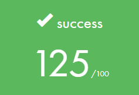
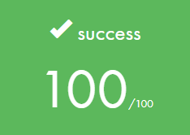
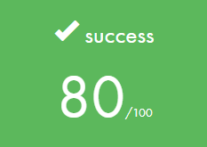
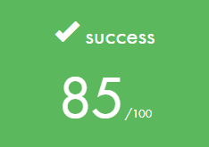
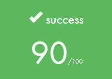
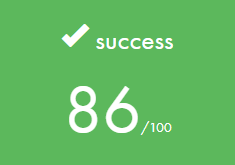
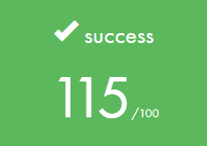

  
  
  
  

# 
WELCOME TO MY GITHUB PAGE

  <table>
    <tr>
      <th colspan="2" align="center">FIRST CIRCLE</th>
      <th colspan="2" align="center">SECOND CIRCLE</th>
    </tr>
    <tr>
      <td>
<a href="https://github.com/mgayout/libft">LIBFT</a>
</td>
      <td></td>
      <td>
<a href="https://github.com/mgayout/so_long">SOLONG</a>
</td>
      <td></td>
    </tr>
	<tr>
      <td>
<a href="https://github.com/mgayout/ft_printf">FT_PRINTF</a>
</td>
      <td></td>
      <td>
<a href="https://github.com/mgayout/push_swap">PUSH_SWAP</a>
</td>
      <td></td>
    </tr>
	<tr>
		<td>
<a href="https://github.com/mgayout/get_next_line">GETNEXTLINE</a>
</td>
		<td></td>
		<td>
<a href="https://github.com/mgayout/pipex">PIPEX</a>
</td>
		<td></td>
	</tr>
	<tr>
		<td>
BORN2BEROOT
</td>
		<td></td>
		<td>
EXAM RANK 02
</td>
		<td></td>
	</tr>
  </table>

  <table>
    <tr>
      <th colspan="2" align="center">THIRD CIRCLE</th>
      <th colspan="2" align="center">FOURTH CIRCLE</th>
    </tr>
    <tr>
      <td>
<a href="https://github.com/mgayout/philosopher">PHILOSOPHER</a>
</td>
	  <td></td>
	  <td>
<a href="https://github.com/mgayout/cub3D">CUB3D</a>
</td>
	  <td></td>
    </tr>
	<tr>
		<td>
<a href="https://github.com/mgayout/minishell">MINISHELL</a>
</td>
		<td></td>
		<td>
NETPRACTICE
</td>
		<td></td>
	</tr>
	<tr>
		<td>
EXAM RANK 03
</td>
		<td></td>
		<td>
EXAM RANK 04
</td>
		<td></td>
	</tr>
  </table>

  <table>
  	<tr>
    	<th colspan="2" align="center">CPP MODULE 0 / 4</th>
		<th colspan="2" align="center">CPP MODULE 5 / 9</th>
    </tr>
    <tr>
		<td>
<a href="https://github.com/mgayout/CPP00">CPP MODULE 00</a>
</td>
		<td></td>
		<td>
<a href="https://github.com/mgayout/CPP05">CPP MODULE 05</a>
</td>
		<td></td>
	</tr>
	<tr>
		<td>
<a href="https://github.com/mgayout/CPP01">CPP MODULE 01</a>
</td>
		<td></td>
		<td>
<a href="https://github.com/mgayout/CPP06">CPP MODULE 06</a>
</td>
		<td></td>
	</tr>
	<tr>
		<td>
<a href="https://github.com/mgayout/CPP02">CPP MODULE 02</a>
</td>
		<td></td>
		<td>
<a href="https://github.com/mgayout/CPP07">CPP MODULE 07</a>
</td>
		<td></td>
	</tr>
	<tr>
		<td>
<a href="https://github.com/mgayout/CPP03">CPP MODULE 03</a>
</td>
		<td></td>
		<td>
<a href="https://github.com/mgayout/CPP08">CPP MODULE 08</a>
</td>
		<td></td>
	</tr>
	<tr>
		<td>
<a href="https://github.com/mgayout/CPP04">CPP MODULE 04</a>
</td>
		<td></td>
		<td>
<a href="https://github.com/mgayout/CPP09">CPP MODULE 09</a>
</td>
		<td></td>
	</tr>
  </table>

  <table>
  	<tr>
    	<th colspan="2" align="center">FIFTH CIRCLE</th>
		<th colspan="2" align="center">SIXTH CIRCLE</th>
    </tr>
    <tr>
		<td>
<a href="https://github.com/mgayout/ft_irc">FT_IRC</a>
</td>
		<td></td>
		<td>
FT_TRANSCENDANCE
</td>
		<td></td>
	</tr>
	<tr>
		<td>
INCEPTION
</td>
		<td></td>
		<td></td>
		<td></td>
	</tr>
	<tr>
		<td>
EXAM RANK 05
</td>
		<td></td>
		<td>
EXAM RANK 06</td>
		<td></td>
	</tr>
  </table>

